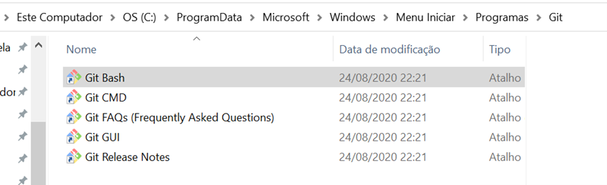
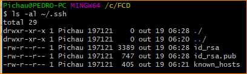
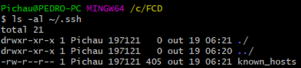

```{r setup, include=FALSE}
knitr::opts_chunk$set(echo = TRUE)
if(!require("dplyr")) install.packages("dplyr")
if(!require("tidyr")) install.packages("tidyr")
```

# RMarkdown

# Github

## Configurações

Abra o terminal do Git Bash em C:\ProgramData\Microsoft\Windows\Start Menu\Programs\Git

{width="400"}

Configurar git

``` {.r}
git config –global user.name "pedro-pc"

git config –global user.email "pedroufv@yahoo.com.br"

git config –global core.editor "code –wait"
```

verificar se deu certo

``` {.r}
git config user.name

git config user.email

git config core.editor
```

Configurar chaves SSH

Para verificar se tem chave cadastrada pelo git bash

*ls -al \~/.ssh*

se tiver chave cadastrada



[Se não tiver]{.ul}

{width="400"}

## Configurações {.tabset .tabset-pills}


### Config

``` {.r}
git config –global user.name "pedro-pc"

git config –global user.email "pedroufv@yahoo.com.br"

git config –global core.editor "code –wait"
```


### Verifica


``` {.r}
git config user.name

git config user.email

git config core.editor
```
## {-}

Meu nome é pedro